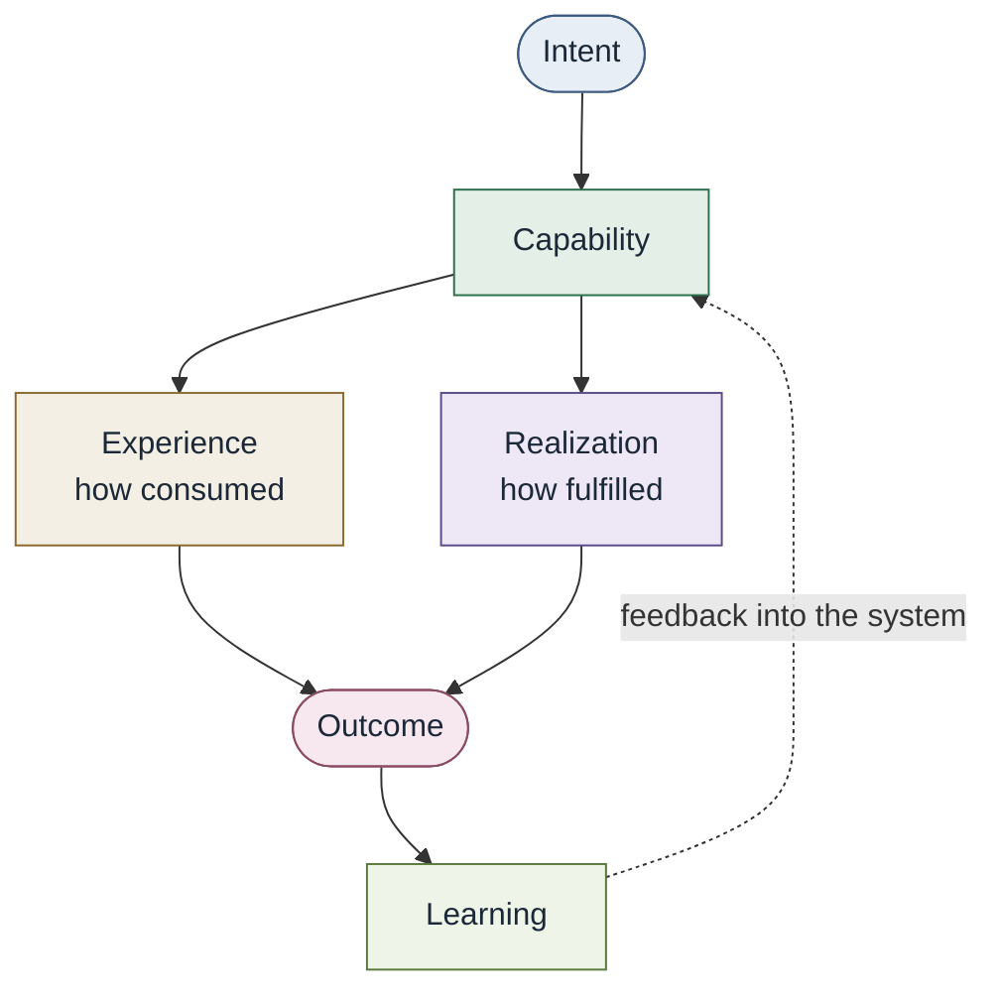

# Convergence

One product. Many specialties. One engineering system.

| | |
| --- | --- |
| Status | Early draft / v0.1 (conceptual core frozen) |
| Kind | Working body of knowledge, not a product or standard |

> Specialization remains. Silos don't.
>
> Convergence is not the convergence of expertise. It is the convergence of delivery.

## Working definitions

| Term | Working definition |
| --- | --- |
| **Convergence** | The evolution of software delivery from an organization of engineering functions into an integrated engineering system. |
| **Converged Engineering** | Designs that system so specialized expertise can participate in delivery through capabilities without requiring consumers to navigate the organizational structures behind them. |

These are working definitions, not established industry definitions.

Expertise remains specialized. Ownership remains explicit. Human judgment
remains essential. What converges is delivery.

> Converged Engineering does not eliminate specialization. It eliminates specialization as a delivery boundary.

It is not a new specialty, team, or job family.
**Convergence cannot be delegated to a Convergence function.**

## The problem

Specializations exist because complex systems require depth. They often
became the delivery architecture itself: a customer need is routed through
product, platform, SRE, infrastructure, networking, identity, security, and
related queues.

The customer experiences none of those boundaries. The customer experiences
one product.

The problem is not specialization. The problem is that specialization became
the architecture of software delivery.

See [The problem](docs/00-foundations/problem.md).

## Conceptual model

A conceptual loop, not a mandatory runtime.

| | |
| --- | --- |
| Capability | What the engineering system can accomplish |
| Experience | How a consumer interacts with it |
| Realization | How the organization currently fulfills it |

Those three must stay distinct. A capability does not have to be an API, a
platform feature, or a formal contract. A human-realized security assessment
and an automated database path can both be capabilities.

See [Conceptual model](docs/00-foundations/conceptual-model.md).

> Your organizational structure should not become your software delivery API.
>
> Encode what is repeatable. Collaborate on what is novel.
>
> Convergence removes accidental complexity while preserving intentional constraint.
>
> Convergence seeks appropriate leverage, not maximum abstraction, automation, standardization, reuse, or self-service.

See [Design doctrine](docs/00-foundations/design-doctrine.md) and
[Major Principles](docs/01-principles/README.md).

Converged Engineering optimizes the engineering system's ability to move
intent to outcome, not the local efficiency of one function. That system
may be local or federated. Convergence does not require one homogeneous
enterprise implementation.

## What this is not

- Not the elimination of SRE, infrastructure, security, platform, or product engineering
- Not "everyone is full stack"
- Not a rename of DevOps or Platform Engineering
- Not an IDP, service catalog, graph database, or agent framework
- Not vendor-owned; no product defines the model
- Not a requirement to buy or build "Convergence infrastructure"
- Not organizational consolidation or a mandated platform
- Not measured by catalogs, automation percentage, or ticket volume

This repository once used "Capability Engineering" as the name of the
discipline. That work remains as the capability *mechanism*. The phrase also
has prior uses in systems engineering. See
[Terminology](docs/00-foundations/terminology.md).

## Documentation

**Start here.** If you are new to this, read in this order:

1. [The problem](docs/00-foundations/problem.md) and
   [Design doctrine](docs/00-foundations/design-doctrine.md) — why this
   exists and the reasoning lens it applies.
2. [Foundations](docs/00-foundations/README.md) and
   [Terminology](docs/00-foundations/terminology.md) — the definitions the
   rest of the work depends on.
3. [The six Major Principles](docs/01-principles/README.md).
4. [Capabilities](docs/02-capabilities/README.md) — intent, capability,
   experience, realization, outcome, learning.
5. [Method](docs/12-method/README.md) — how to actually do the work.

Everything else (architecture, operating model, patterns, anti-patterns,
adoption) is reference you can reach for once those five are clear.

If you came to disagree, read
[How to critique this](docs/00-foundations/how-to-critique.md) after that
path. It separates frozen claims from applied guidance and from questions
left parked on purpose.

| Group | Section | Contents |
| --- | --- | --- |
| Core | [00 Foundations](docs/00-foundations/README.md) | Definitions, conceptual model, design doctrine, problem, terminology, open questions, how to critique |
| Core | [01 Principles](docs/01-principles/README.md) | Six Major Principles |
| Core | [02 Capabilities](docs/02-capabilities/README.md) | Intent, capability, experience, realization, contracts, graph |
| Core | [03 Architecture](docs/03-architecture/README.md) | Composition, policy attachment, observation, consumption, graph, federation |
| Core | [04 Operating model](docs/04-operating-model/README.md) | What changes per discipline; planning, staffing, funding |
| Core | [05 AI-native engineering](docs/05-ai-native-engineering/README.md) | Agents as consumers, agent-facing contracts, authorization |
| Core | [06 Maturity](docs/06-maturity-model/README.md) | Characteristics as spectra, deliberately not a score |
| Core | [07 Patterns](docs/07-patterns/README.md) | Recurring designs, with their costs |
| Core | [08 Anti-patterns](docs/08-anti-patterns/README.md) | Recurring failure modes |
| Core | [09 Reference architecture](docs/09-reference-architecture/README.md) | Non-normative conceptual reference |
| Core | [11 Adoption](docs/11-adoption/README.md) | Startup through brownfield sketches |
| Core | [12 Method](docs/12-method/README.md) | How to do the work: trace, evaluate, identify, decide, design, operate |
| Core | [Diagrams](diagrams/README.md) | Conceptual diagrams |
| Later | [10 Implementations](docs/10-reference-implementations/README.md) | Non-canonical examples |
| Process | [RFCs](rfcs/README.md) | Conceptual change |

## Contribution

Editorial fixes and examples are welcome. Changes to Convergence, Converged
Engineering, principles, the conceptual model, terminology, or architecture
go through an [RFC](rfcs/README.md).

See [CONTRIBUTING.md](CONTRIBUTING.md), [GOVERNANCE.md](GOVERNANCE.md),
and [How to critique this](docs/00-foundations/how-to-critique.md).

## License

Documentation is licensed under [Creative Commons Attribution 4.0
International](LICENSE) (CC BY 4.0). If executable examples or code are added
later, they should use Apache License 2.0 unless a later decision says
otherwise.
