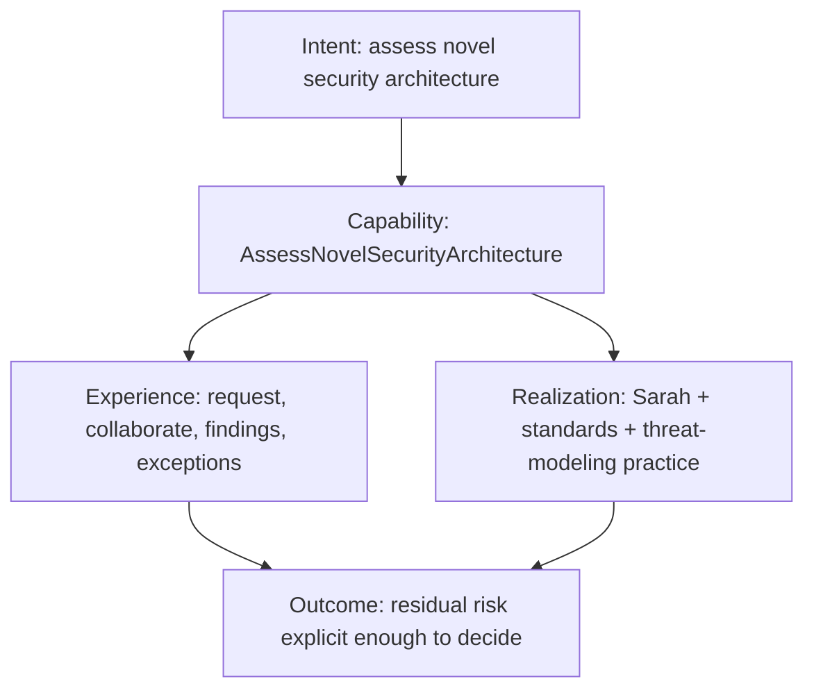

# AssessNovelSecurityArchitecture

Human-realized capability. Expertise is Sarah's. The organization still
possesses the capability.

See [Worked examples](../docs/02-capabilities/worked-examples.md).
