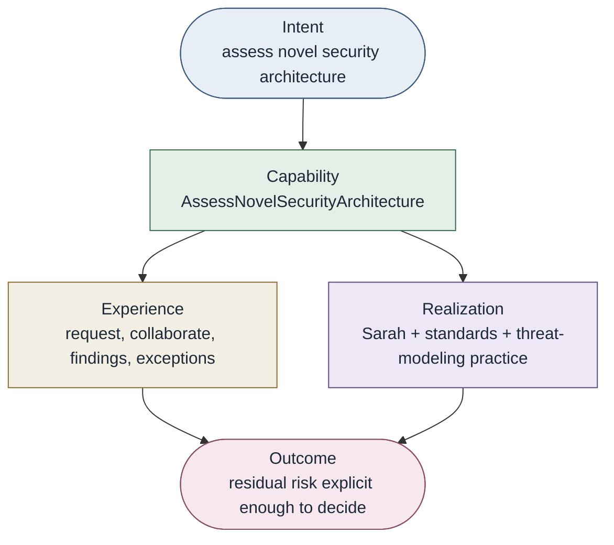

# AssessNovelSecurityArchitecture

Human-realized. Sarah holds expertise. The organization still holds the
capability.

```mermaid
flowchart TB
  Intent(["Intent<br/>assess novel security architecture"]):::intent
  Cap["Capability<br/>AssessNovelSecurityArchitecture"]:::cap
  Exp["Experience<br/>request, collaborate, findings, exceptions"]:::exp
  Real["Realization<br/>Sarah + standards + threat-modeling practice"]:::real
  Out(["Outcome<br/>residual risk explicit enough to decide"]):::out

  Intent --> Cap
  Cap --> Exp
  Cap --> Real
  Exp --> Out
  Real --> Out

  classDef intent fill:#E8EEF6,stroke:#3D5A80,color:#1B2838
  classDef cap fill:#E4EFE7,stroke:#2F6F4E,color:#1B2838
  classDef exp fill:#F4EFE4,stroke:#8A6A2F,color:#1B2838
  classDef real fill:#EEE8F6,stroke:#5B4B8A,color:#1B2838
  classDef out fill:#F6E8EE,stroke:#8A4B63,color:#1B2838
```

See [Worked examples](../docs/02-capabilities/worked-examples.md).
