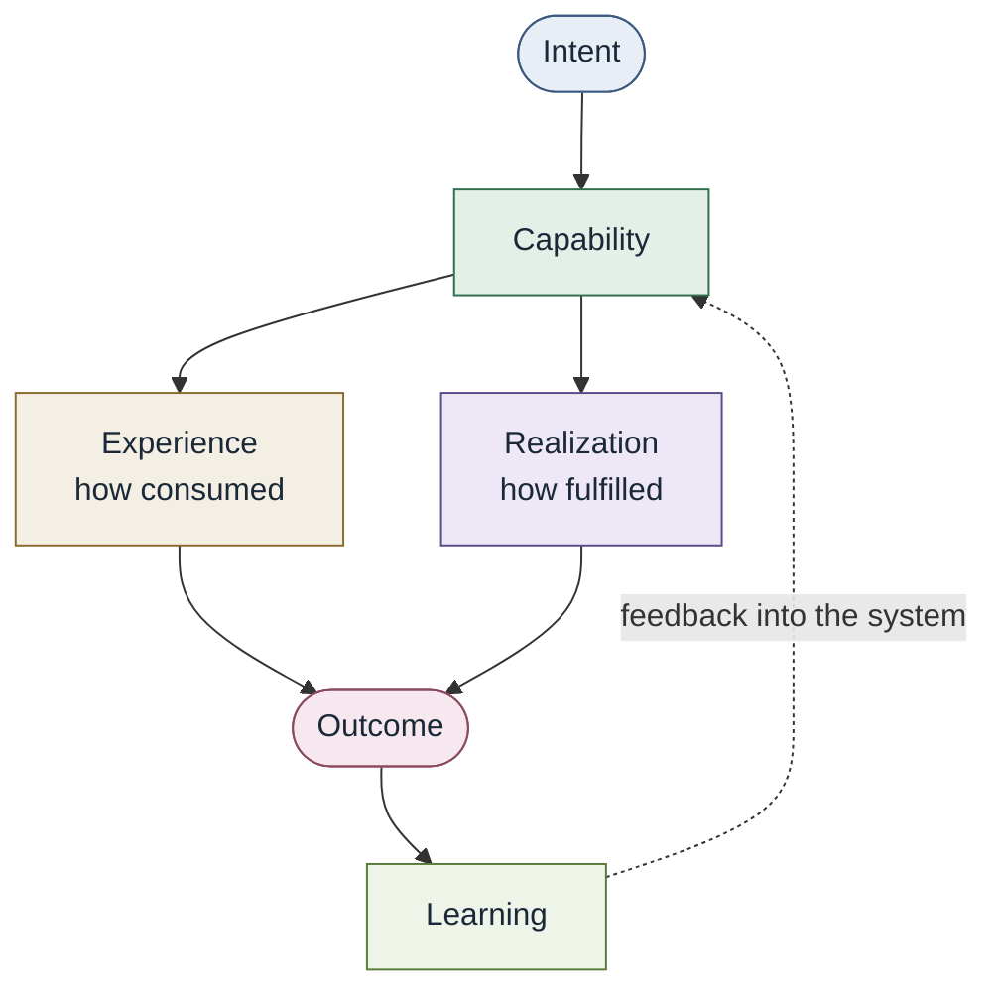

# AssessNovelSecurityArchitecture

Human-realized. Same loop as the [core model](core-conceptual-model.md).
Expertise sits in the security-architect role. The organization still
holds the capability.

| Node | This example |
| --- | --- |
| Intent | Assess a security architecture that has not shipped before |
| Capability | `AssessNovelSecurityArchitecture` |
| Experience | Request, collaborate, findings, exceptions |
| Realization | Security architect, standards, threat-modeling practice |
| Outcome | Residual risk explicit enough to decide |
| Learning | Repeated requests may be encoded; novel work stays with the architect |

See [Worked examples](../docs/02-capabilities/worked-examples.md).
