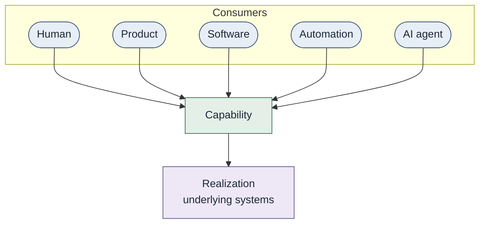

# Capability consumers

Different consumers. Same capability layer.

```mermaid
flowchart TB
  subgraph consumers["Consumers"]
    direction LR
    Human(["Human"]):::intent
    Product(["Product"]):::intent
    Soft(["Software"]):::intent
    Auto(["Automation"]):::intent
    Agent(["AI agent"]):::intent
  end

  Graph["Capability"]:::cap
  Systems["Realization<br/>underlying systems"]:::real

  Human --> Graph
  Product --> Graph
  Soft --> Graph
  Auto --> Graph
  Agent --> Graph
  Graph --> Systems

  classDef intent fill:#E8EEF6,stroke:#3D5A80,color:#1B2838
  classDef cap fill:#E4EFE7,stroke:#2F6F4E,color:#1B2838
  classDef exp fill:#F4EFE4,stroke:#8A6A2F,color:#1B2838
  classDef real fill:#EEE8F6,stroke:#5B4B8A,color:#1B2838
  classDef out fill:#F6E8EE,stroke:#8A4B63,color:#1B2838
  classDef learn fill:#EEF4E8,stroke:#5A7A3A,color:#1B2838
  classDef team fill:#F3F4F6,stroke:#6B7280,color:#111827
```

See [Agents as capability consumers](../docs/05-ai-native-engineering/agents-as-capability-consumers.md).
