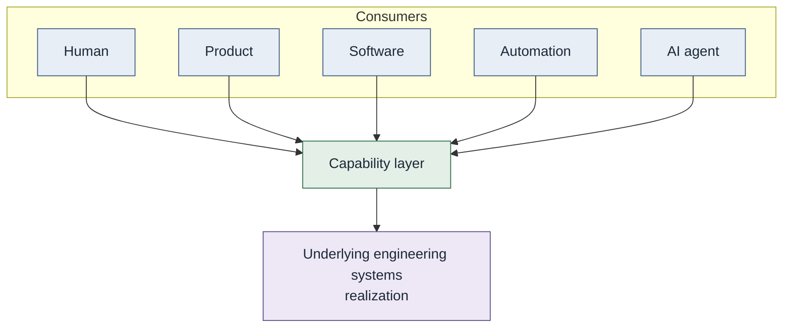

# Capability consumers

Different consumers. Same capability layer. Authorization may differ.
The graph should not.

See [Agents as capability consumers](../docs/05-ai-native-engineering/agents-as-capability-consumers.md).
