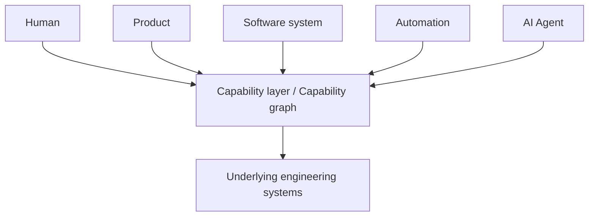

# Capability consumers

Humans, products, software systems, automation, and AI agents consume the
same capability layer. Other capabilities may compose that layer as well.
Underlying engineering systems remain implementation.

Authorization and experience may differ by consumer class. The graph should
not. Agents should invoke authorized capabilities rather than discover
which team owns networking or which queue provisions databases.

See [Agents as capability consumers](../docs/05-ai-native-engineering/agents-as-capability-consumers.md).
