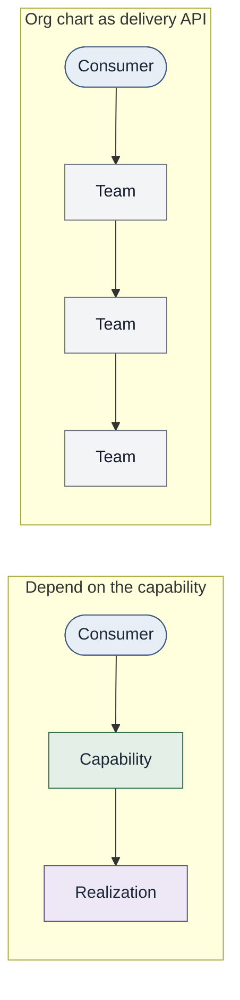

# Consumer, capability, realization

Same consumer. Two interfaces.

```mermaid
flowchart LR
  subgraph good["Depend on the capability"]
    direction TB
    C1(["Consumer"]):::intent --> Cap["Capability"]:::cap
    Cap --> R["Realization"]:::real
  end

  subgraph bad["Org chart as delivery API"]
    direction TB
    C2(["Consumer"]):::intent --> T1["Team"]:::team
    T1 --> T2["Team"]:::team
    T2 --> T3["Team"]:::team
  end

  classDef intent fill:#E8EEF6,stroke:#3D5A80,color:#1B2838
  classDef cap fill:#E4EFE7,stroke:#2F6F4E,color:#1B2838
  classDef exp fill:#F4EFE4,stroke:#8A6A2F,color:#1B2838
  classDef real fill:#EEE8F6,stroke:#5B4B8A,color:#1B2838
  classDef out fill:#F6E8EE,stroke:#8A4B63,color:#1B2838
  classDef learn fill:#EEF4E8,stroke:#5A7A3A,color:#1B2838
  classDef team fill:#F3F4F6,stroke:#6B7280,color:#111827
```

See [Organizational independence](../docs/02-capabilities/organizational-independence.md).
