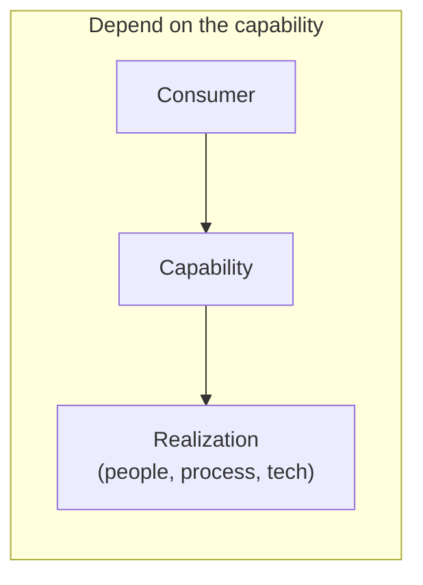
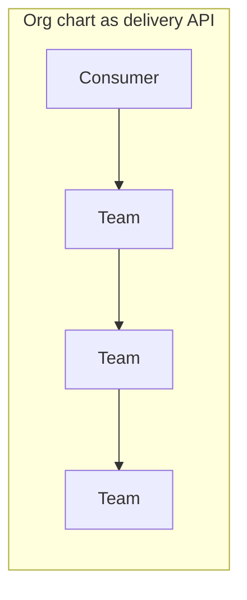

# Consumer, capability, realization

Preferred conceptual path (left) versus organizational routing (right).

Ownership stays discoverable. It should not be required for routine
routing. See
[Organizational independence](../docs/02-capabilities/organizational-independence.md).
