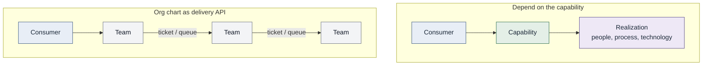

# Consumer, capability, realization

Same consumer, two interfaces. Ownership stays discoverable. It should
not be required for routine routing.

See [Organizational independence](../docs/02-capabilities/organizational-independence.md).
