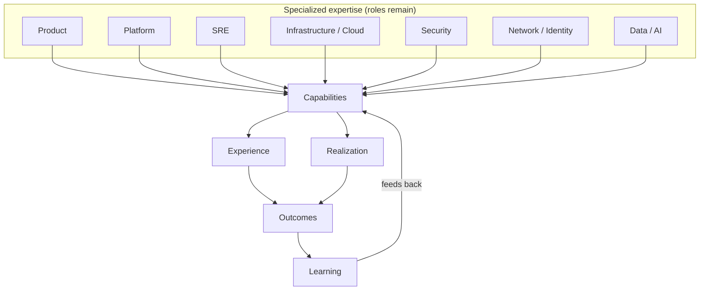

# Converged Engineering conceptual model

Specialized disciplines remain separate. They contribute expertise into
shared capabilities. Capabilities have experiences and realizations.
Outcomes produce learning that feeds the system.

This is not a merger into one generic engineering role.

Contrast: [Traditional organizational delivery model](traditional-delivery-model.md).
