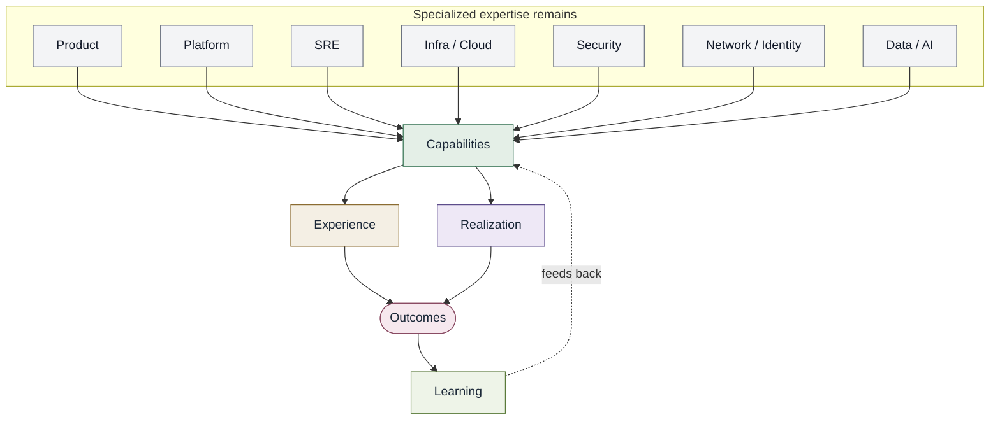

# Converged Engineering conceptual model

Specialties remain separate. They contribute into capabilities. They do
not merge into one role.

Contrast: [Traditional delivery](traditional-delivery-model.md).
