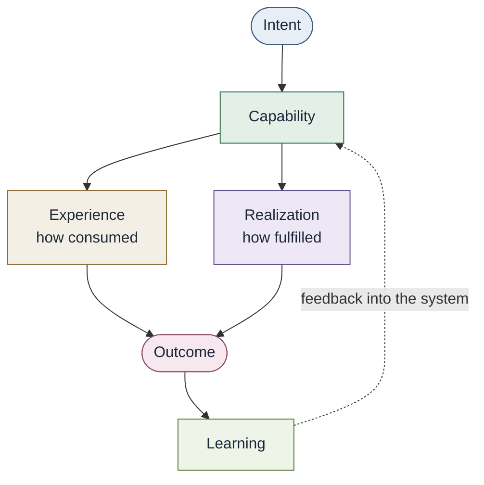

# Core conceptual model

Conceptual only. Not a runtime or control plane.

| Node | Meaning |
| --- | --- |
| Intent | Result the consumer is trying to cause |
| Capability | What the engineering system can accomplish |
| Experience | How the capability is consumed |
| Realization | How the capability is currently fulfilled |
| Outcome | Resulting state that advances intent |
| Learning | Evidence that changes the system |

See [Conceptual model](../docs/00-foundations/conceptual-model.md).
