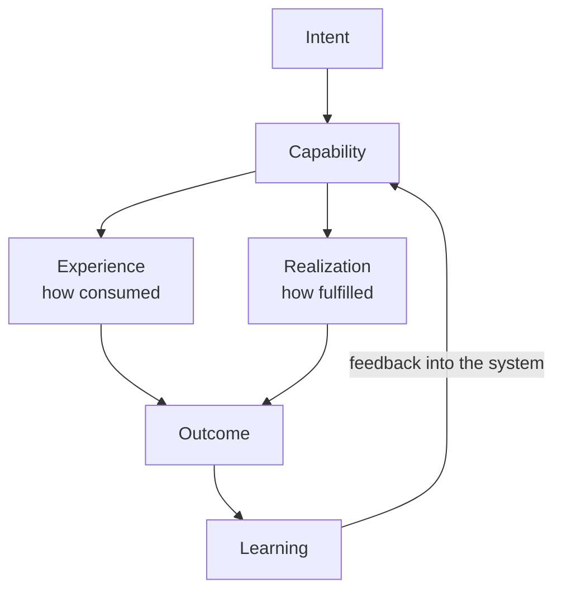

# Core conceptual model

Conceptual only. Not a runtime or control plane.

```mermaid
flowchart TB
  Intent["Intent"]
  Cap["Capability"]
  Exp["Experience\nhow consumed"]
  Real["Realization\nhow fulfilled"]
  Out["Outcome"]
  Learn["Learning"]

  Intent --> Cap
  Cap --> Exp
  Cap --> Real
  Exp --> Out
  Real --> Out
  Out --> Learn
  Learn -->|"feedback into the system"| Cap
```

See [Conceptual model](../docs/00-foundations/conceptual-model.md).
