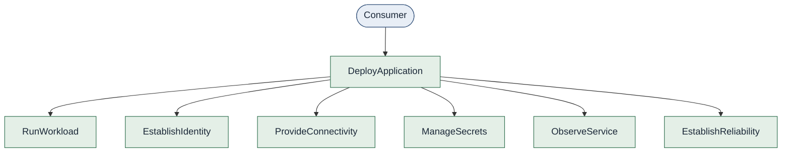

# DeployApplication composition

Illustrative names. Composition is relative.

```mermaid
flowchart TB
  Consumer(["Consumer"]):::intent
  Deploy["DeployApplication"]:::cap
  Run["RunWorkload"]:::cap
  Id["EstablishIdentity"]:::cap
  Net["ProvideConnectivity"]:::cap
  Secrets["ManageSecrets"]:::cap
  Obs["ObserveService"]:::cap
  Rel["EstablishReliability"]:::cap

  Consumer --> Deploy
  Deploy --> Run
  Deploy --> Id
  Deploy --> Net
  Deploy --> Secrets
  Deploy --> Obs
  Deploy --> Rel

  classDef intent fill:#E8EEF6,stroke:#3D5A80,color:#1B2838
  classDef cap fill:#E4EFE7,stroke:#2F6F4E,color:#1B2838
  classDef exp fill:#F4EFE4,stroke:#8A6A2F,color:#1B2838
  classDef real fill:#EEE8F6,stroke:#5B4B8A,color:#1B2838
  classDef out fill:#F6E8EE,stroke:#8A4B63,color:#1B2838
  classDef learn fill:#EEF4E8,stroke:#5A7A3A,color:#1B2838
  classDef team fill:#F3F4F6,stroke:#6B7280,color:#111827
```

See [Composite capabilities](../docs/02-capabilities/composite-capabilities.md).
