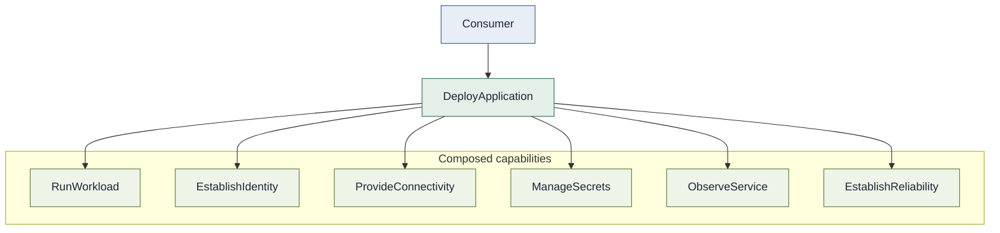

# DeployApplication composition

Illustrative names. Composition is relative. These are not atomic units.

```mermaid
flowchart TB
  Consumer["Consumer"]:::actor
  Deploy["DeployApplication"]:::cap

  subgraph composed["Composed capabilities"]
    direction TB
    Run["RunWorkload"]:::comp
    Id["EstablishIdentity"]:::comp
    Net["ProvideConnectivity"]:::comp
    Secrets["ManageSecrets"]:::comp
    Obs["ObserveService"]:::comp
    Rel["EstablishReliability"]:::comp
  end

  Consumer --> Deploy
  Deploy --> Run
  Deploy --> Id
  Deploy --> Net
  Deploy --> Secrets
  Deploy --> Obs
  Deploy --> Rel

  classDef actor fill:#E8EEF6,stroke:#3D5A80,color:#1B2838
  classDef cap fill:#E4EFE7,stroke:#2F6F4E,color:#1B2838
  classDef comp fill:#EEF4E8,stroke:#5A7A3A,color:#1B2838
```

See [Composite capabilities](../docs/02-capabilities/composite-capabilities.md).
