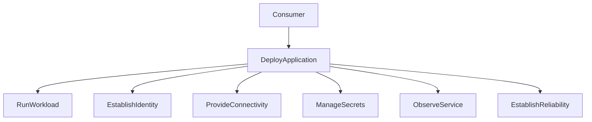

# DeployApplication composition

Illustrative names, not a catalog standard. Composition is relative;
these components are not objectively atomic.

See [Composite capabilities](../docs/02-capabilities/composite-capabilities.md).
