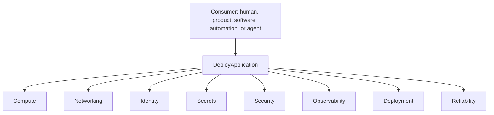

# DeployApplication composition

Illustrative only. Names are examples, not a catalog standard.

The consumer invokes `DeployApplication`. That capability composes others.
The consumer of the high-level capability does not have to consume each
provider's process.

See [Anatomy of a capability](../docs/02-capabilities/anatomy-of-a-capability.md).
