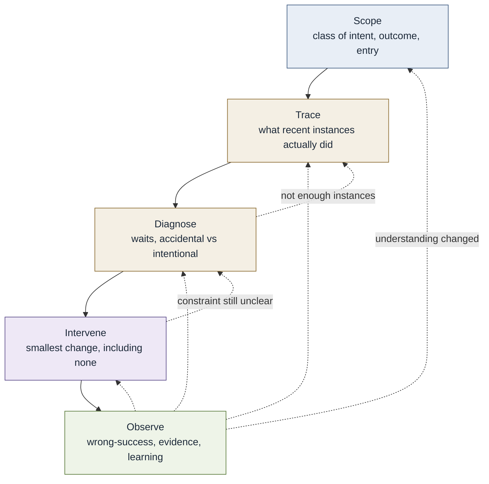

# Method cycle

The work of designing the engineering system. This is **not** the
[conceptual model](core-conceptual-model.md). The conceptual model
describes how intent becomes outcome. This describes the deliberate work
of examining and changing that path. See the
[initial application method](../docs/12-method/README.md).

The order is a default, not a gate sequence. Observe may return to any
earlier move when evidence changes understanding. If there is nothing
useful to change or watch, **stop** — iteration is not mandatory.
Identify, encode, and design remain as **depth**, not required extra
stages.
