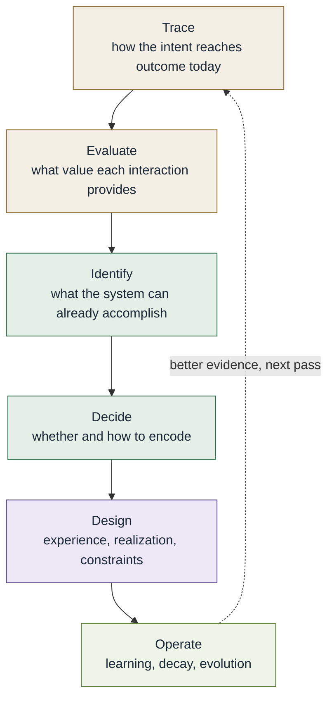

# Method cycle

The work of designing the engineering system. This is **not** the
[conceptual model](core-conceptual-model.md). The conceptual model
describes how intent becomes outcome. This describes the deliberate work
of examining and changing that path.

The order is a reading order, not a gate sequence. Real work moves
backward as often as forward.

See [Method](../docs/12-method/README.md).
