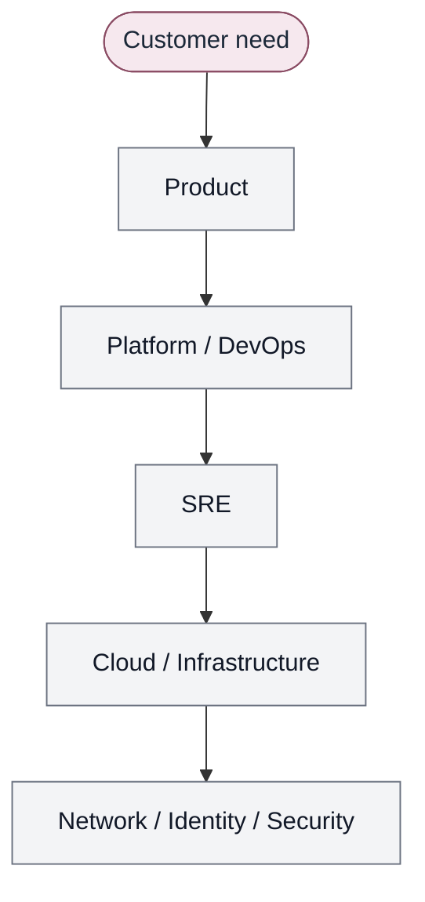

# Traditional organizational delivery

Handoffs, not a reporting line. The customer experiences one product.

Contrast: [Converged Engineering](converged-engineering-model.md).
Narrative: [The problem](../docs/00-foundations/problem.md).
