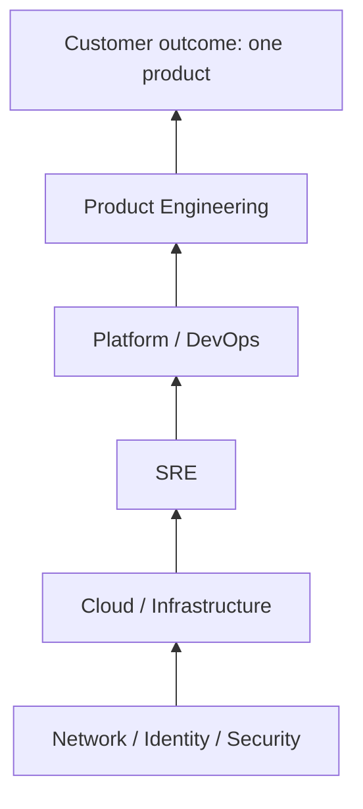

# Traditional organizational delivery model

Arrows are **potential organizational handoffs**, not a required reporting
line and not a claim that every company looks like this. Many organizations
are flatter or more entangled. The point is the shape: a customer need is
fulfilled by climbing a stack of specialist groups.

The customer does not experience those groups. The customer experiences
one product.

Contrast: [Converged Engineering conceptual model](converged-engineering-model.md).

Narrative: [The problem](../docs/00-foundations/problem.md).
