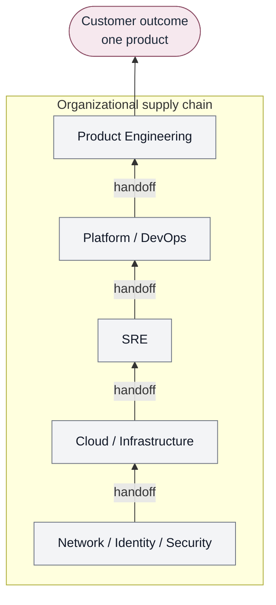

# Traditional organizational delivery model

Arrows are **potential organizational handoffs**, not a reporting line.
The customer does not experience those groups. The customer experiences
one product.

Contrast: [Converged Engineering](converged-engineering-model.md).
Narrative: [The problem](../docs/00-foundations/problem.md).
