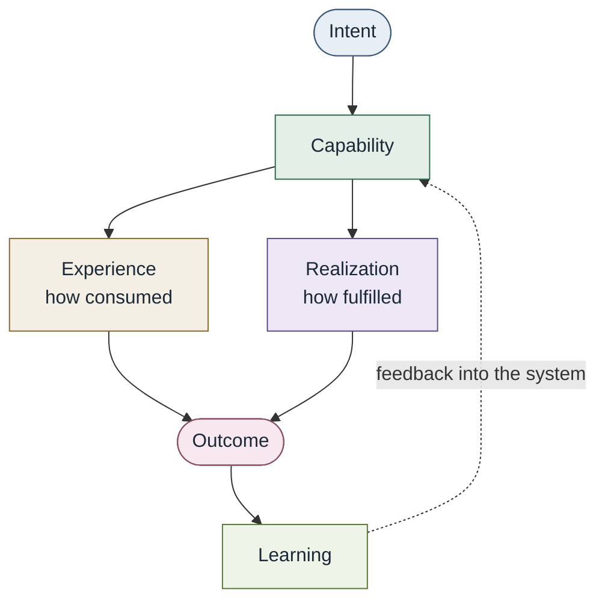

# Conceptual model

This is a **conceptual** model of Converged Engineering. It is not a
mandatory runtime, control plane, catalog, portal, or graph database.

| Concept | Question it answers |
| --- | --- |
| [Intent](../02-capabilities/intent.md) | What result is the consumer trying to cause, at a level they can own? |
| [Capability](../02-capabilities/capability.md) | What can the engineering system accomplish? |
| [Experience](../02-capabilities/experience.md) | How does a consumer discover, request, use, and observe it? |
| [Realization](../02-capabilities/realization.md) | How is it currently fulfilled? |
| [Outcome](../02-capabilities/output-and-outcome.md) | What resulting state satisfies or advances intent? |
| [Learning](../02-capabilities/learning.md) | What evidence is capable of changing what the system believes? |

Related: [composite capabilities](../02-capabilities/composite-capabilities.md) ·
[contracts](../02-capabilities/capability-contract.md) ·
[capability graph](../02-capabilities/capability-graph.md) ·
[ownership](../02-capabilities/ownership-and-authority.md) ·
[organizational independence](../02-capabilities/organizational-independence.md) ·
[coordination and collaboration](../02-capabilities/coordination-and-collaboration.md)

Worked examples: [ProvideRelationalStorage and AssessNovelSecurityArchitecture](../02-capabilities/worked-examples.md)

Same diagram: [diagrams/core-conceptual-model.md](../../diagrams/core-conceptual-model.md)

## Distinctions that must not collapse

| If it describes | It belongs to |
| --- | --- |
| **What** the engineering system can accomplish | Capability |
| **How a consumer interacts** with that ability | Experience |
| **How the organization fulfills** that ability | Realization |
| Something **produced** | Output |
| A **resulting state** that advances intent | Outcome |

A capability can exist without a formal contract, without automation, and
without a dedicated platform. Encoding repeatable expertise changes
realization and leverage. It does not create the capability from nothing.

The engineering system in this loop is the relevant system through which
a class of intent moves toward outcome. It may be local, domain-scoped,
enterprise, or federated. See
[Converged architecture](../03-architecture/converged-architecture.md).

## Representation is not reality

Capabilities, contracts, policies, and models represent organizational
knowledge; they are not perfect representations of reality.

Abstraction must not manufacture false certainty.

Abstract complexity. Expose consequence and uncertainty where they matter
to responsible action.

The more execution is delegated, the more uncertainty, consequence,
authority, and recovery must become explicit.

v0.1 does not add an uncertainty node, confidence schema, or risk score.
See [Open questions](open-questions.md).

## What this model is not

It does not require Kubernetes, an IDP, a workflow engine, a service
catalog, or a graph database. A startup may realize capabilities with Git,
conventions, CI, IaC, docs, and conversation. A regulated enterprise may
add machine-readable contracts and audit. Both can practice Converged
Engineering.
