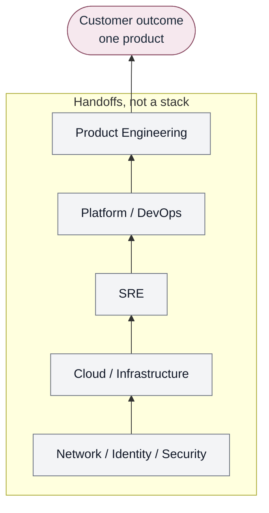

# The problem

The problem isn't specialization. The problem is that specialization became
the architecture of software delivery.

## Specialization was earned

Software systems grew past what a single team could reasonably own. Networks,
identity, runtime platforms, data stores, threat models, and production
failure modes each became deep enough to justify dedicated expertise.

That split produced real gains:

- **Product engineering** learned to ship customer-facing software on short
  cycles, with product judgment about what to build.
- **Infrastructure engineering** made compute, storage, and facilities
  reliable enough to be assumed.
- **Cloud engineering** turned capacity and managed services into something
  that could be provisioned in hours instead of quarters.
- **Networking and identity** made connectivity and trust explicit, which is
  a prerequisite for any serious system.
- **Security engineering** reduced the cost of getting certain classes of
  failure wrong.
- **Site Reliability Engineering** brought production empiricism, error
  budgets, and incident learning into organizations that had treated
  "operations" as a separate caste.
- **DevOps** (as a cultural and tooling movement) attacked the wall between
  writing software and running it.
- **Platform engineering** tried to productize internal developer experience
  so that every team did not reinvent pipelines, environments, and golden
  paths.
- **Data and AI engineering** made analytics, models, and (increasingly)
  agents part of the product, with their own failure modes and controls.

None of that was a mistake. The people who hold that expertise are not the
bottleneck by virtue of existing. The bottleneck appears when the *only*
interface to their expertise is the organization itself.

## The organizational supply chain

A customer need is simple to state. Inside the company it is often
decomposed into an organizational supply chain:

The customer experiences none of these organizational boundaries. The
customer experiences one product.

Consider a product team that needs to expose a new customer workflow. The
promised job for the customer is one outcome. Internally:

1. Product engineering designs the workflow and application changes.
2. Someone files for an environment, a namespace, or a cloud account.
3. Networking is asked for connectivity, DNS, certificates, or firewall
   changes.
4. Identity is asked for roles, tokens, or group mappings.
5. Security is asked to review the design, the exceptions, or the scan
   results.
6. Platform or DevOps is asked for a pipeline, a deployment pattern, or a
   portal request.
7. SRE is asked after launch, or during an incident, to make it reliable.

Each step may be justified. Each step is also a **handoff**: a ticket, a
queue, an approval, a meeting, or a Slack thread in the dialect of a
particular team.

Delivery latency becomes a function of how many internal APIs (human APIs)
the outcome must traverse.

Arrows in the traditional model are not "layers of the stack." They are
potential organizational requests:

See [Traditional organizational delivery model](../../diagrams/traditional-delivery-model.md).

## Tickets, queues, and approvals

Ticketing systems are honest: they make work visible. They also freeze
expertise into a request-response protocol. The specialist answers a
particular instance of a problem. The next team files a similar ticket. The
knowledge stays in the specialist's head, in a wiki that is not the
interface, or in a runbook that only that team runs.

Approvals have the same shape. A security or change-advisory gate can catch
real risk. When the gate is the *primary* control, governance is appended
after design rather than encoded in what teams are allowed to compose. Work
waits. Exceptions become the real process.

## Tribal knowledge and ownership boundaries

When the interface is a person or a team, onboarding means learning who to
ask. Ownership maps become the discovery mechanism. That does not scale to
new hires, to other time zones, or to software and agents that cannot attend
standups.

An AI agent should not need to know which team owns networking, who
approves identity, which Slack channel owns Kubernetes, or which ticket
queue provisions databases. If those are the interfaces, the agent will be
blocked or over-privileged. Humans already pay that tax; agents make it
incompressible.

Layer-oriented optimization follows. A cloud team is measured on account
provisioning time. An SRE team is measured on incident metrics for systems
they did not design. A platform team is measured on portal tickets closed. A
product team is measured on feature output. Each local optimum can be
rational and still produce a slow, fragile path to a customer outcome.

DevOps did not fail because automation is wrong. It often stalled because
"you build it, you run it" collided with specialized controls that still had
to be requested by ticket. Platform engineering did not fail because
developer experience is wrong. It often stalled when the platform became a
new front door to the same queues: more buttons, same supply chain.

## Expertise is the asset

The argument of this body of work is not that specialists should stop
specializing. It is that routine delivery should consume **capabilities**
(what the system can accomplish) rather than impersonating an org-chart
walk. Repeatable expertise should be encoded into realizations and
experiences. Novel work remains collaboration. See
[Coordination and collaboration](../02-capabilities/coordination-and-collaboration.md).

Infrastructure engineers should spend more of their time making compute,
network, and identity consumable under contract, and less time fulfilling
one-off requests that differ only in the ticket number. SRE should encode
reliability into those capabilities rather than meeting every service as a
novel operational problem. Security should put controls into the contract and
continuous verification, not only into the calendar of reviews.

The developer is not the platform team's customer in the sense that
optimizing developer satisfaction is the company's purpose. The developer is
part of the product value chain. The customer outcome is the purpose.
Capabilities exist so that specialized knowledge serves that chain instead of
sitting behind a counter.

Capabilities are a primary mechanism. They are not a promise that catalogs
and contracts dissolve every political or staffing problem.

## What would count as progress

Progress is not "we bought a portal," "we renamed the DevOps team," or "we
staffed Convergence Engineering." Progress is when intent can move to
outcome through capabilities without the consumer assembling the
organization for routine work, governance is a property of the system
where it can be, and learning changes realizations and encodings. Not
every capability needs a formal contract or automation.

Until then, specialization remains valuable, and silos remain the delivery
architecture.

See [Convergence](convergence.md) and
[Converged Engineering](converged-engineering.md).
