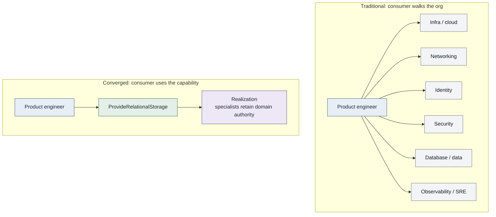

# Specialization remains. Silos don't.

**Major Principle 1 of Convergence** (working doctrine, v0.1)

Convergence preserves specialized engineering expertise while removing
specialization as a routine delivery boundary.

**Converged Engineering does not eliminate specialization. It eliminates
specialization as a delivery boundary.**

**Your organizational structure should not become your software delivery
API.**

## Specialization is not a silo

| Specialization | Silo |
| --- | --- |
| Concentrates expertise | Restricts access to that expertise |
| Required by complex systems | Makes the team the only interface |
| Keeps domain authority | Makes routine work an org-chart walk |

Infrastructure, security, reliability, networking, identity, data, product,
platform, and related domains retain their expertise, authority, and
ownership.

Convergence is not the convergence of expertise. It is the convergence of
**delivery**. Specialties stay. The routine path to an outcome should not
require assembling the org chart.

## Consume the expertise, not the expert

When expert knowledge becomes understood, repeatable, and predictable,
organizations should encode that knowledge into reusable mechanisms rather
than requiring the specialist to participate manually in every transaction.

Those mechanisms may include capabilities and contracts. They may also
include policies, automation, standards, tooling, and other engineering
interfaces. This principle does not require that every encoding be a
capability.

This does **not** mean experts are less valuable or should be removed from
engineering work. The opposite is intended: expert time is too valuable to
spend repeatedly solving problems the organization already knows how to
solve.

**Encode what is repeatable. Collaborate on what is novel.**

## Repeatable vs novel

| Repeatable | Novel |
| --- | --- |
| Intent is familiar | Exception, unusual risk, new architecture |
| Risk is characterized | Judgment the encoding does not cover |
| Outcome predictable enough to describe | Collaboration with specialists |
| **Signal** that encoding may be warranted | Not a failure of the model |

Repeatability is not an absolute rule. Not every repeated interaction must
become automated or self-service. Some repetition is still cheaper or safer
as a conversation.

**Make exceptional work exceptional again.** Routine, understood work
should flow through reusable engineering mechanisms. Novel work should
flow through human collaboration.

## Organizational boundaries are not automatically silos

Convergence does not claim that every organizational boundary is bad.

Teams can exist. Approvals can exist. Centralized expertise can be the
right design. The difference is what the boundary is doing.

| Healthy boundary | Silo |
| --- | --- |
| Establishes ownership, accountability, and domain authority | Becomes the interface for work the organization already knows how to do |
| Manages risk and separates concerns | Requires routine delivery to traverse it by ticket, queue, meeting, or tribal knowledge |
| Concentrates specialized expertise | Makes a team's availability the constraint on routine work |
| Applies judgment to cases that need it | Re-applies a settled judgment on request |

**Boundaries can be healthy. Dependency on a boundary for routine
execution is what Convergence challenges.**

A silo, in this usage, is not "a team exists." It is "the team is the
interface for work the organization already knows how to do."

## Diagnostic

Does routine delivery require engineers to know which team owns the next
step?

A frequent yes is evidence that organizational structure may have become
part of the software delivery interface.

## Example: persistent relational storage

Intent: "My application needs persistent relational storage."

Each specialist group may be highly competent. Competence is not the issue.
The consumer should not have to understand and traverse that structure to
satisfy a standard intent.

A database capability can encode appropriate expertise from those domains
behind a stable contract: allowed engines and sizes, network placement,
identity and encryption defaults, backup and observability expectations,
data-class policy. The product engineer consumes the contract. They do not
become a database administrator, a network engineer, or a security
engineer.

The capability does **not** replace those specialists. They retain domain
authority and responsibility for what the capability encodes. When a
request falls outside the supported contract (unusual topology, novel
risk, a data class the path does not cover), specialists become directly
involved. That is the novel path working as designed.

## Desired state

Specialists advance and govern their domains. Routine consumers benefit
from that expertise through stable engineering interfaces without needing
to understand the organizational structure behind them.

## What this principle does not mean

- Everyone becomes full-stack.
- Specialists disappear.
- Teams disappear.
- Product engineers must become infrastructure experts.
- Developers must become security experts.
- Every interaction must become self-service.
- Every engineering decision can be automated.
- Centralized expertise is inherently bad.
- Humans should never approve engineering decisions.
- Every organizational boundary is a silo.

## Relationship to capabilities

Capabilities are one primary way to encode repeatable expertise. This
Major Principle is about specialization and delivery, not about mandating
a catalog. Capability-specific guidance belongs under
[capabilities](../02-capabilities/README.md), not as a substitute for this
principle.
