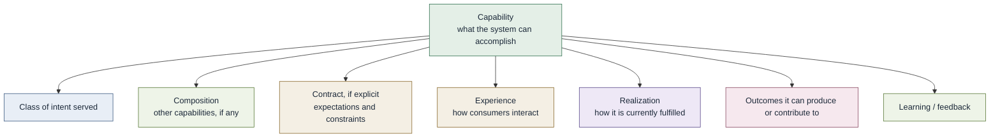

# Anatomy of a capability

Optional facets. Not a mandatory schema. A capability can exist with
little more than a recognized intent and some realization (including a
person).

Do not confuse the capability with its contract, experience, or
realization.

Contract-related facets, when used, may include inputs, expected
outcomes, constraints, policies, eligibility, reliability, cost,
ownership, exceptions, and lifecycle. See
[Capability contract](capability-contract.md).

Rigor should match complexity, risk, reuse, and scale.

## DeployApplication

`DeployApplication` is a [composite](composite-capabilities.md)
capability. See
[DeployApplication composition](../../diagrams/deploy-application-composition.md)
and [Worked examples](worked-examples.md).
