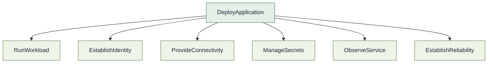

# Composite capabilities

Capabilities may compose other capabilities.

`DeployApplication` may compose, for example:

`DeployApplication` is then a **composite capability**.

Do not describe the lower-level capabilities as objectively atomic.
Composition is recursive and relative to the abstraction being modeled.
`RunWorkload` may itself compose compute placement, runtime policy, and
other capabilities.

If something describes **what** the system can accomplish, it may be a
capability. How the consumer interacts is [experience](experience.md).
How the organization fulfills it is [realization](realization.md).

See [DeployApplication composition](../../diagrams/deploy-application-composition.md).

`LaunchRegulatedAPI` may compose `RunWorkload`, `EstablishIdentity`,
`ProvideConnectivity`, `ProtectSensitiveData`, `ObserveService`, and
`EstablishReliability`. Security expertise can contribute across several
of those without "Security Team" appearing as a delivery stage. See
[Capability graph](capability-graph.md).
