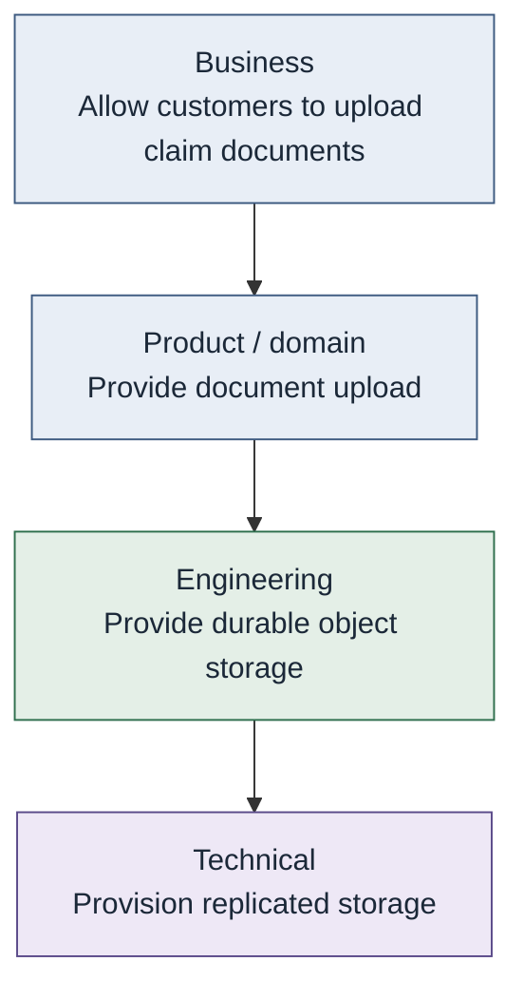

# Intent

**Intent** is the result a consumer is trying to cause, expressed at the
level of responsibility that consumer owns.

> Intent should be expressed at the highest level of abstraction the consumer can responsibly own.

Abstraction should be available where it removes irrelevant
responsibility, not imposed where the consumer legitimately owns that
responsibility. Higher abstraction is not automatically better. Shared
capability reuse is not automatically preferable. Seek **appropriate
leverage, not maximum reuse.** A network engineer may still express
technical networking intent because that is the level they own.

## Conceptual levels (not a mandatory taxonomy)

| Level | Example |
| --- | --- |
| Business | Allow customers to upload claim documents |
| Product / domain | Provide document upload |
| Engineering | Provide durable object storage |
| Technical | Provision replicated storage |

A product engineer requesting `ProvideRelationalStorage` is expressing
engineering intent they can own. They should not have to own "which
firewall form" unless that is their job.

## Consumers of intent

Humans, products, software systems, automation, and authorized agents may
express intent. Agents still act under a principal and policy.

See [Conceptual model](../00-foundations/conceptual-model.md).
