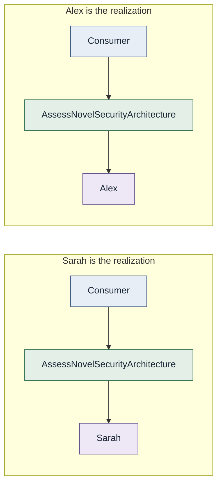

# Organizational independence

**A capability is organizationally independent to the degree that
consumers can successfully discover and use it without understanding the
organizational structure responsible for its realization.**

This is a spectrum, not a binary.

It does **not** mean ownership disappears, teams disappear, humans
disappear, consumers can never contact owners, or organizational
boundaries are inherently bad.

> Ownership should be discoverable without being required for routing.

## Example

The consumer still depends on the capability, not on knowing Sarah. Fulfillment
is conceptual. It is not a required product.

See [Consumer to capability to realization](../../diagrams/consumer-capability-realization.md).
