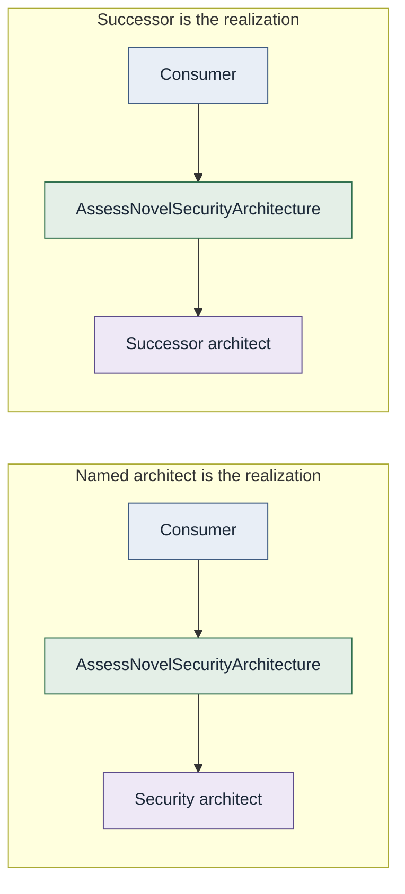

# Organizational independence

**A capability is organizationally independent to the degree that
consumers can successfully discover and use it without understanding the
organizational structure responsible for its realization.**

This is a spectrum, not a binary.

It does **not** mean ownership disappears, teams disappear, humans
disappear, consumers can never contact owners, or organizational
boundaries are inherently bad.

Organizational independence must not imply organizational opacity.
Ownership, authority, provenance, operational responsibility, and
auditability may remain discoverable when they are not required for
routing.

> Ownership should be discoverable without being required for routing.

See [Major Principle 3](../01-principles/03-organization-is-an-implementation-detail.md).

## Example

The consumer still depends on the capability, not on knowing a particular
person. Fulfillment is conceptual. It is not a required product.

See [Consumer to capability to realization](../../diagrams/consumer-capability-realization.md).
