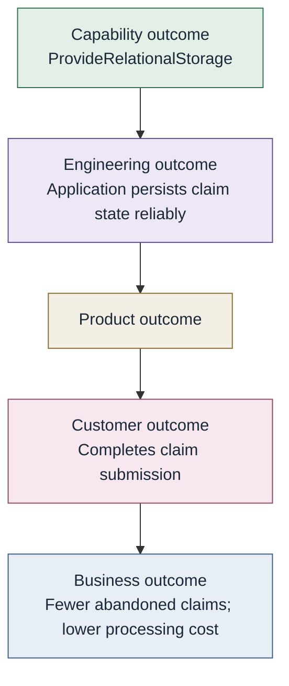

# Output and outcome

**An output is something produced. An outcome is a resulting state that
satisfies or advances intent.**

| | Output | Outcome |
| --- | --- | --- |
| Relational storage | Database instance exists | Application has usable, compliant, resilient persistence for the intent |
| Security assessment | A written report | Residual risk is explicit enough to decide |

Do not force every engineering capability to claim direct business
outcomes.

## Contribution upward (not a mandatory taxonomy)

> Own the outcome you can control. Trace the outcomes you contribute to.

The relational-storage capability contributes to broader outcomes. It
does not own the business result. That is
[outcome ownership](ownership-and-authority.md) at the right level.
