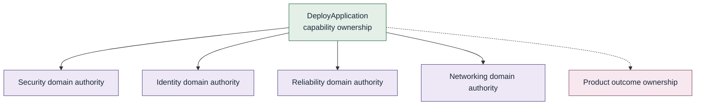

# Ownership and authority

Three distinct accountabilities. Shared contribution does not require
shared accountability.

| | Accountable for |
| --- | --- |
| **Domain authority** | What is correct within a specialized domain or decision scope |
| **Capability ownership** | Stewardship and continued fitness of a capability |
| **Outcome ownership** | The result closest to the intent being pursued |

Authority does not imply execution. Execution does not imply authority.
Ownership is not itself a security boundary. Privilege (what an actor is
technically permitted to do) is a separate concern and is not defined
here.

Accountability includes learning and evolution, not merely conformance.
See [Major Principle 5](../01-principles/05-distribute-execution.md).

This repository does not prescribe which team must own each layer.

> Ownership should be discoverable without being required for routing.

See [Organizational independence](organizational-independence.md).
