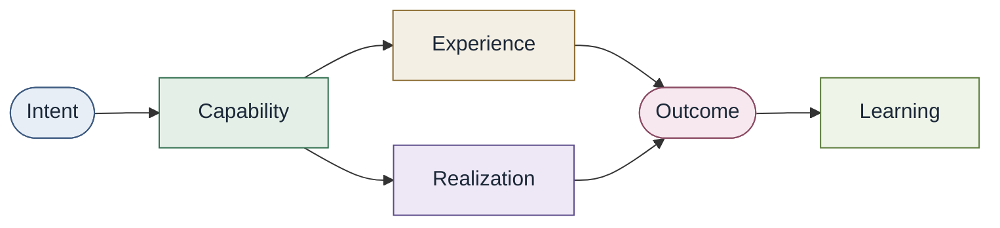
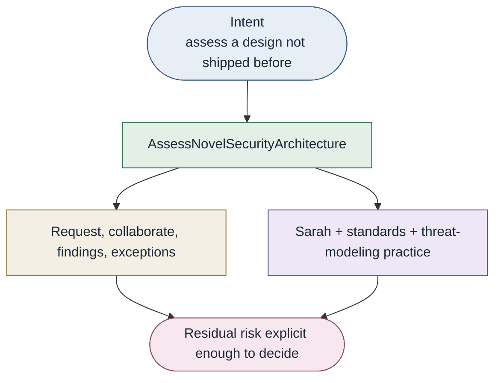

# Worked examples

Two contrasting capabilities. Same conceptual model. One is often
technology-realized. One is often human-realized. Both are capabilities.

Recurring names: `ProvideRelationalStorage` · `DeployApplication` ·
`AssessNovelSecurityArchitecture` · `LaunchRegulatedAPI`

## ProvideRelationalStorage

| Facet | This example |
| --- | --- |
| Intent | Persistent relational storage the product engineer is eligible to use (not "open the DBA queue") |
| Capability | `ProvideRelationalStorage` |
| Experience | Handbook plus PR, API, portal, or conversation: size class, data class, environment |
| Realization | DBA by hand; Terraform plus cloud SQL; platform plus managed PostgreSQL; approval plus automation |
| Output | A database instance exists |
| Outcome | The application has usable, policy-fitting relational persistence |
| Learning | Repeated exceptions become policy; missing observability is added to realization |

The capability can outlast a change of realization. Contribution upward to
claim submission and cost is [traced, not owned](output-and-outcome.md).

## AssessNovelSecurityArchitecture

| Facet | This example |
| --- | --- |
| Intent | Security architecture assessment of a new design |
| Capability | The organization can satisfy that class of intent |
| Experience | Request, context, collaboration, findings, exceptions |
| Realization | Sarah (expertise), standards, practice. Fragile if only Sarah. Still a capability. |
| Output | Written assessment, meeting, findings list |
| Outcome | Design assessed; residual risk explicit for outcome owners |
| Learning | Repeated "novel" requests get encoded; Sarah returns to remaining novel work |

If Sarah is replaced by Alex, consumers still use the capability, not
Sarah's calendar. See
[Organizational independence](organizational-independence.md) and
[diagram](../../diagrams/assess-novel-security-architecture.md).

## DeployApplication and LaunchRegulatedAPI

`DeployApplication` composes workload, identity, connectivity, secrets,
observability, and reliability. `LaunchRegulatedAPI` additionally depends
on protecting sensitive data and exception-time human governance.

See [Composite capabilities](composite-capabilities.md) and
[Regulated enterprise](../11-adoption/regulated-enterprise.md).
