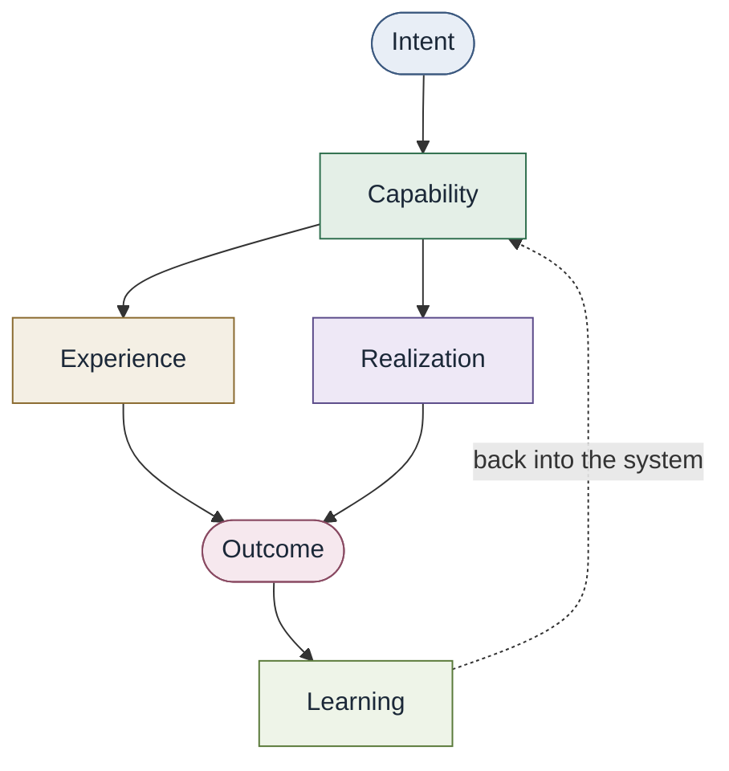

# Converged architecture

A loop, not a stack of org functions to climb. Specialties remain
distinct. They contribute expertise into capabilities. They do not merge
into one role.

Product, Platform, SRE, Infrastructure, Cloud, Security, Networking,
Identity, Data, AI, and related expertise **feed** capabilities. In the
traditional model those groups sit in a chain. Here they are sources of
realization and domain authority, not a request ladder.

Clusters, identity providers, pipelines, and similar systems remain
implementation (realization). Portals and CLIs are experience. Neither
is the capability.

A platform may host discovery or compose realizations. It is not the
architecture by itself.

See [Conceptual model](../00-foundations/conceptual-model.md) and
[Capability graph](../02-capabilities/capability-graph.md).

Conceptual vs implementation (examples only, not requirements):

| Conceptual | Might be implemented as (optional) |
| --- | --- |
| Capability graph | Docs, spreadsheet, catalog, graph DB |
| Contract | Markdown, OpenAPI, policy-as-code |
| Experience | Conversation, CLI, portal, agent tools |
| Realization | People, IaC, managed services, hybrids |
