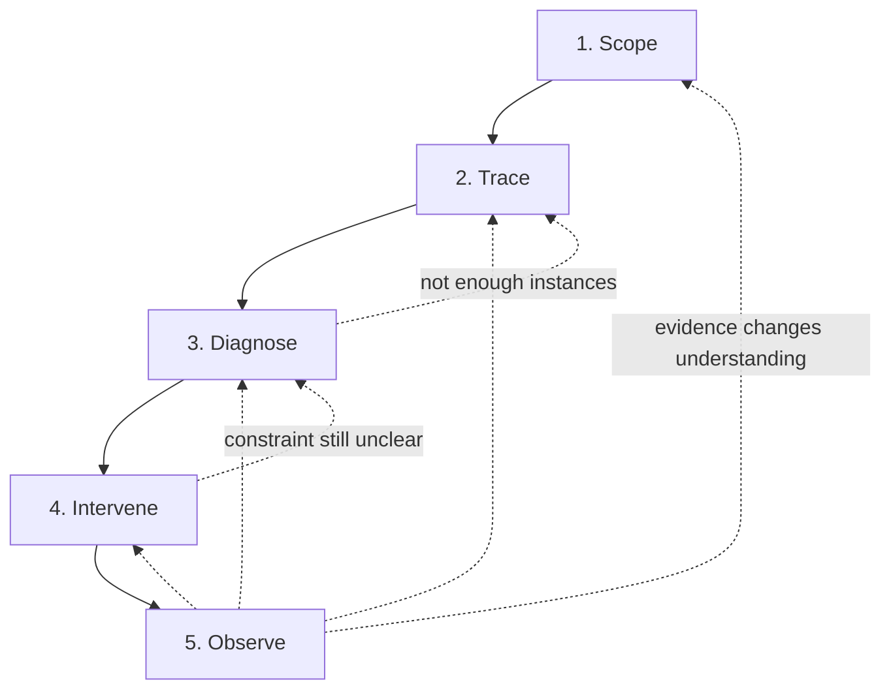

# Method

This is the **initial application method** for Convergence: what to do
with one bounded class of intent. It is **emerging**, not field-validated,
not the only way to apply Convergence, and not a second frozen core. The
five moves are a practical grouping, not permanently fixed doctrine.

It applies the [Major Principles](../01-principles/README.md) and
[design doctrine](../00-foundations/design-doctrine.md). It does not add
to them.

**Start here:** Scope → Trace → Diagnose → Intervene → Observe.

**Go deeper** only as the case requires: the six activity documents under
this folder, plus other corpus diagnostics. They are not a second method.

You do not need the whole repository. This page is enough to begin. The
[application record](application-record.md) is a thinking aid, not a
required governance artifact.

## Thesis the method serves

Specialization is necessary. The problem is not specialization. The problem
is when organizational boundaries become the **routine delivery
interface** to specialized expertise.

The method preserves specialization, domain authority, human judgment,
ownership, accountability, provenance, intentional governance, and
valuable collaboration. It tries to reduce unnecessary routing,
coordination, repeated handoffs, and accidental friction.

> Specialization remains. Silos don't.
>
> Encode what is repeatable. Collaborate on what is novel.
>
> Remove accidental friction. Design intentional friction.

## When to apply

Use this method when a **bounded** engineering-system problem looks like
one or more of:

- Routine delivery crosses several specialties.
- Work waits on tickets, queues, approvals, meetings, ownership lookup,
  or other organizational routing.
- Local teams look successful while end-to-end delivery of this intent
  is poor.
- A portal, API, or "self-service" may only front a manual queue.
- The same expertise is consumed through repeated handoffs.
- Authority, execution, and ownership have become confused.
- Several valid parts compose into an invalid or unaccountable whole.

Do **not** use it as a mandatory overlay on ordinary local engineering
work that already stays inside one specialty with a clear owner.

If you cannot name the class of intent, you are not ready to use this
method. Gather that name first. You can still use a single principle or
distinction without a full pass.

## Unit of application

The unit is the **engineering system scoped to one class of intent moving
toward an outcome** — not the enterprise, not a platform program, and
not an org chart.

Choose a scope small enough to finish. A **design goal** (not measured
evidence) is that a competent practitioner can follow recent instances in
about **60–120 minutes** before deciding whether deeper investigation is
warranted:

- One recurring consumer intent (for example: "eligible relational storage
  for a standard application").
- A named outcome the consumer cares about (storage usable, incident
  contained, control satisfied).
- Someone willing to own the *result of the analysis*, not necessarily
  every contributing team.

Stop widening the scope when additional specialties would only appear
as "and then it goes to them." Capture that as a wait. Do not start an
enterprise map.

## The five moves

These five moves are the **front door**. They were collapsed from the
earlier six-activity reading order so practitioners are not given two
processes. **Identify / encode / design** remain as depth, not extra
required stages. The order is a default, not a gate sequence, and not
the only valid way to reason with the corpus.

| Move | Question | Depth (optional) |
| --- | --- | --- |
| **1. Scope** | What class of intent, toward what outcome, and is Convergence even the right tool? | This page |
| **2. Trace** | What actually happens on recent instances? | [Tracing a flow](tracing-a-flow.md) |
| **3. Diagnose** | Why does it wait? What is capability vs experience vs realization? What is accidental vs intentional? | [Evaluating interactions](evaluating-interactions.md), then conditionals below |
| **4. Intervene** | What is the smallest change that could improve the *system* — including change nothing? | [Choosing an intervention](choosing-an-intervention.md) |
| **5. Observe** | What would look like success while the system did not improve? What evidence will we watch? | [Operating and evolving](operating-and-evolving.md) |

One abstract flow is [worked](worked-method-example.md). Treat it as
illustration, not a required template and not evidence that the method
works.

If the intervention is **change nothing** and there is nothing useful to
watch, **stop**. Iteration is available, not mandatory.

This diagram is the **design cycle**. It is not the
[conceptual model](../00-foundations/conceptual-model.md) (intent →
capability → experience / realization → outcome → learning).

### 1. Scope

**Purpose.** Bound the analysis so it can finish.

**Look at.** Complaints, elapsed time vs work time, recurring consumer
asks, a recent instance you can name.

**Ask.** What is trying to happen? For whom? What outcome counts? Why
might this be organizational routing rather than a local engineering
gap? Who will own the analysis result?

**Evidence.** A one-sentence intent, a one-sentence outcome, two or three
recent instances, a reason Convergence applies (from the trigger list).

**Decisions it can change.** Whether to apply the method at all; how
narrow the class of intent is; whether the problem is local and this
method should stop.

**Output.** The top of the [application record](application-record.md).

**Continue** when the intent is named and at least one instance can be
followed. **Stop** when the work is ordinary local engineering, or when
nobody will own the outcome of changing it (you can still trace; you
cannot intervene honestly).

### 2. Trace

**Purpose.** Follow reality, not the org chart or the wiki.

**Look at.** What three recent instances actually did: tickets, Slack,
meetings, approvals, tribal lookup, tools, waits.

**Ask.** What is trying to happen? How is it consumed? How is it
fulfilled? Where does work wait? Where does specialist judgment enter?
Where does organizational routing enter?

**Evidence.** Ordered interactions. For each: what it decides, whose
authority, what expertise, what it waits on, whether the answer ever
differs. See [Tracing a flow](tracing-a-flow.md).

**Decisions it can change.** Where the system actually is; which
"documented process" is fiction; which people are the realization.

**Output.** The current-trace section of the application record.

**Continue** when you can follow intent to outcome without a large
unexplained gap. **Stop widening** when the next hop is "another
department's process" you cannot see — record it as a wait with reason
**unknown**, do not invent an enterprise survey.

Do not begin by drawing reporting lines.

### 3. Diagnose

**Purpose.** Separate valuable constraint and collaboration from accidental
coordination — without scoring waste.

**Look at.** The trace. Apply a light capability / experience /
realization cut and a wait/friction cut. Apply other diagnostics only
when triggered.

**When using this method, ask** (not a requirement of every engineering
task, and not a requirement to use every Convergence concept):

- What can the system currently accomplish (even if only a person can
  do it)?
- How is that consumed? How is it fulfilled?
- Why does each wait exist? (Categories overlap; unknown is allowed.)
- Where is friction intentional (judgment, safety, governance,
  authority, risk)?
- Where is it accidental (discovery, translation, inherited process,
  org routing)?

**Wait / friction reasons** (hypotheses, not scores): current specialist
judgment; intentional governance or control; technical dependency;
capacity or resource constraint; missing information; organizational
routing; accidental process; unknown.

A slow security determination and a slow "who owns databases?" lookup
can cost the same time and have opposite value. See
[Evaluating interactions](evaluating-interactions.md).

**Decisions it can change.** What must be preserved; what may be removed
or reshaped; whether the portal/API is the problem or only the
experience; whether encoding is even on the table.

**Output.** Meaningful waits, intentional constraints, and a one-sentence
**system problem** (not a team indictment).

**Continue** into intervene when the system problem is specific enough
to target. **Stop** (and observe only, or change nothing) when you cannot
tell accidental from intentional without violating a domain you do not
understand — get the domain authority into the conversation rather than
guessing.

### 4. Intervene

**Purpose.** Choose the **smallest** intervention that could improve the
engineering system for this class of intent.

**Look at.** The system problem, domain authorities, what is already
encoded, anti-patterns (portal as ticket router, capability as team
rename).

**Ask.** What could we clarify, encode, reshape, or leave alone? Who
keeps authority? What would false success look like?

Possible outcomes include: clarify an existing capability; improve
experience; change realization; encode repeatable expertise; retain
explicit specialist collaboration; remove organizational routing;
redesign an intentional control; clarify authority; change a composition
seam; improve observation; change ownership expectations; **change
nothing**.

**Change nothing is a successful pass** when the path is already well
designed or when encoding would freeze unsettled judgment.

See [Choosing an intervention](choosing-an-intervention.md).

**Decisions it can change.** What gets built, written, stopped, or
explicitly deferred; who remains the domain authority.

**Output.** Proposed intervention (or explicit none) plus
wrong-success condition.

**Continue** to observe when you need evidence (a change, a deferral you
want visible, or a wrong-success risk). **Stop** when change nothing is
the result and nothing needs watching, or when the intervention would
require an enterprise program, a Convergence function, or a platform
purchase as a prerequisite. Those are not this method.

### 5. Observe

**Purpose.** Learning is evidence that *could* change what the system
believes. It does not mandate change.

**Look at.** Exceptions, workarounds, abandonment, repeated questions,
incidents, specialists doing the work beside the path, local metrics vs
end-to-end outcome.

**Ask.**

> What could look like success while the engineering system did not
> actually improve?

Did we move the queue to Slack? Improve a local SLA and worsen the path?
Let a platform absorb specialist authority?

**Evidence.** Whatever you can actually see for this intent. Do not
invent a metrics program.

**Decisions it can change.** Re-enter the trace; widen or narrow the
contract; unwind an encoding; leave the deferral in place.

**Output.** Evidence-to-observe section of the application record.

## Always-used vs conditional

| When using this method | Conditional | Advanced / skip unless the case forces it |
| --- | --- | --- |
| Named class of intent and outcome | Naming a capability (verb-led) | [Federation](../03-architecture/federation.md) |
| Instance trace (not org chart) | [Encode vs collaborate](deciding-what-to-encode.md) when work repeats | Enterprise graph, catalog, taxonomy |
| Wait / friction *why* | Authority vs execution when work crosses a domain seam | Maturity spectra, reference architecture |
| Accidental vs intentional | [Composition](designing-experience-and-realization.md#composition-guardrails) when several abilities contribute to one intent | Agent-facing contracts |
| Experience vs realization cut (catches portal-same-queue) | Organizational independence when "self-service" is the proposed fix | |
| Wrong-success check | Human vs automated realization when automation is proposed | |
| Smallest intervention, including none | | |

Authority analysis is **not** a RACI replacement. Use it when execution
crosses a domain: authority does not imply execution; execution does
not imply authority; ownership is not routing; composition must not
silently expand authority.

## Wrong-success

Write this on the pass (also on the application record):

**What could look like success while the engineering system did not
actually improve?**

Examples: portal launched, queue remains; ticket removed, coordination
moved to Slack; automation increased, judgment or authority became
unsafe; local SLA improved, end-to-end latency worsened; platform
absorbed specialist authority; a control was removed in the name of
flow.

## Stop rule

A bounded pass is enough when:

- The class of intent is clear.
- Recent instances can be followed without a large invented gap.
- Major waits and dependencies are understood *or honestly marked unknown*.
- Intentional constraints and domain authority are known well enough
  not to violate them.
- The intervention (including none) targets an *observed* accidental
  weakness or an explicit deferral — not a diagram gap.
- An outcome for this intent can be observed, even qualitatively.

You do not need a complete model of the enterprise.

## Practitioner prerequisites

A competent engineer or architect who can talk to both a consumer of the
intent and at least one domain participant.

**Intended usability** (design goals, not empirical claims): about
**30 minutes** to learn the five moves from this page; about
**60–120 minutes** for a first bounded pass before deciding on deeper
work. Those times are not validated.

You do not need a Convergence vocabulary quiz. You do need permission
to follow a real instance, including Slack and hallway steps.

## Failure modes the method should refuse

- Treating everything as a capability.
- Assuming every wait is waste.
- Automating uncertain judgment.
- Erasing governance because it is slow.
- Centralizing domain authority in a platform team.
- Replacing reality with diagrams.
- Optimizing the path by violating a legitimate domain constraint.
- Inventing a Convergence team, path owner, or consulting ceremony.
- Requiring a platform, catalog, or graph to begin.

## Minimum working artifact

At most one [application record](application-record.md) per pass, if it
helps you think. Not a document set and not a required filing.

## Maturity

**Initial application method.** Derived from the existing corpus. Not
independently field-validated. A combination of established practices can
produce similar designs. Practical value still requires use.

## What this method is not

- Not a maturity model, certificate, or transformation program.
- Not required for every engineering problem.
- Not the only way to apply Convergence.
- Not a reason to reorganize. See
  [Major Principle 3](../01-principles/03-organization-is-an-implementation-detail.md).
- Not a mandate to encode or automate whatever it finds.
- Not dependent on a platform, catalog, graph database, or tool purchase.

If the method only works with tooling, it has become the thing it is
supposed to remove. See [Startup](../11-adoption/startup.md).

[Brownfield](../11-adoption/brownfield.md) remains a sketch of the same
starting point. This page is the method; those bullets are not a second
process.
